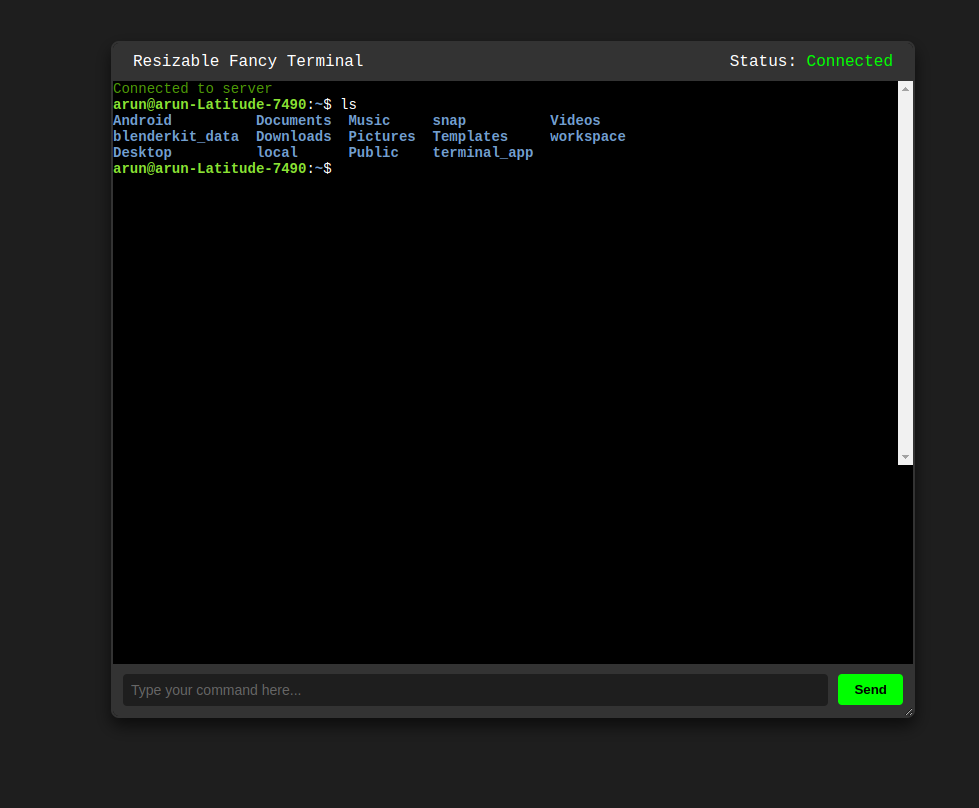

# Resizable Fancy Terminal

This project demonstrates a web-based, resizable terminal interface built using Node.js, WebSockets, and the `xterm.js` library. The terminal is fully interactive, allowing users to send commands to a server-side shell and receive real-time output.

## Features

- **WebSocket-based communication**: Enables real-time interaction with a server-side shell.
- **Resizable terminal**: Users can resize the terminal window dynamically.
- **Draggable interface**: The terminal container can be repositioned on the screen.
- **Customizable appearance**: Styled with `xterm.js` and CSS for a modern terminal look.
- **Cross-platform support**: Works with Bash on Unix-like systems and `cmd.exe` on Windows.


---

## How It Works

### Backend (`server.js`)

1. **WebSocket server**:
   - Listens on `ws://localhost:5000`.
   - Handles client connections and forwards commands between the frontend and a server-side pseudo-terminal (PTY).

2. **Node PTY integration**:
   - Creates a persistent shell session using `node-pty`.
   - Resizes the terminal dynamically based on client requests.

3. **Command flow**:
   - User inputs from the frontend are sent to the server via WebSocket.
   - The server writes commands to the shell and sends back the output.

### Frontend (`index.html`)

1. **Terminal UI**:
   - Built using the `xterm.js` library for an authentic terminal experience.
   - Includes a text box and send button for input, in addition to keyboard interactions.

2. **Connection management**:
   - Displays connection status updates (e.g., connected, disconnected, error).

3. **Drag-and-resize functionality**:
   - Implements a draggable and resizable terminal container for enhanced usability.

---

## Setup and Usage

### Prerequisites

- Node.js installed on your system.
- Basic knowledge of terminal and command-line operations.

### Installation

1. Clone the repository or download the code files.
2. Install the required dependencies:
   ```bash
   npm install ws node-pty
   ```

### Running the Server

1. Start the WebSocket server:
   ```bash
   node server.js
   ```
2. The server will listen on `ws://localhost:5000`.

### Accessing the Terminal

1. Open `index.html` in any modern web browser.
2. Interact with the terminal interface to send and receive commands.

---

## Commands and Features

### Sending Commands

- **Terminal input**: Type commands directly into the terminal interface.
- **Input box**: Use the text input field to enter commands and click "Send".

### Resizing Terminal

- Drag the corner or edges of the terminal container to resize.

### Dragging Terminal

- Click and hold the header bar to drag and reposition the terminal window.

### Resizing Shell

- The shell dynamically adjusts its dimensions when the terminal container is resized.

---

## Customization

### Changing Shell

Modify the `shell` variable in `server.js` to use a different shell (e.g., `zsh`, `fish`).

### Adjusting Terminal Appearance

Edit the `xterm.js` initialization options in `index.html` to customize themes, font size, etc.

---

## Known Issues

- Ensure the WebSocket server is running before accessing the frontend.
- Proper handling of shell-specific commands depends on the server environment.

---

## License

This project is open-source under the [MIT License](LICENSE).

Feel free to use, modify, and contribute!
